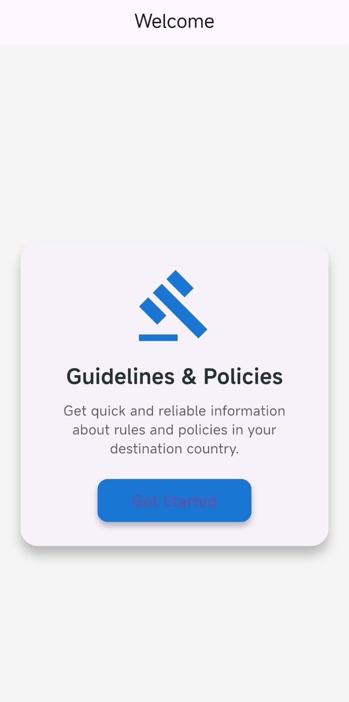
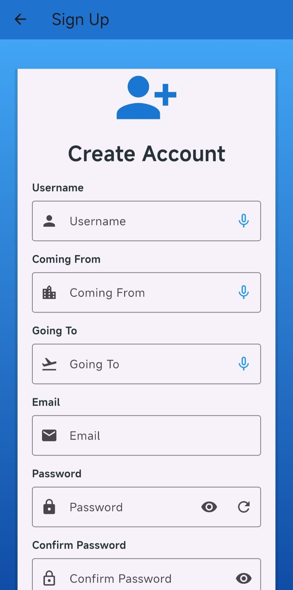
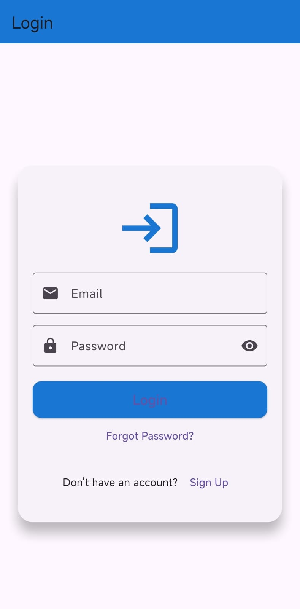
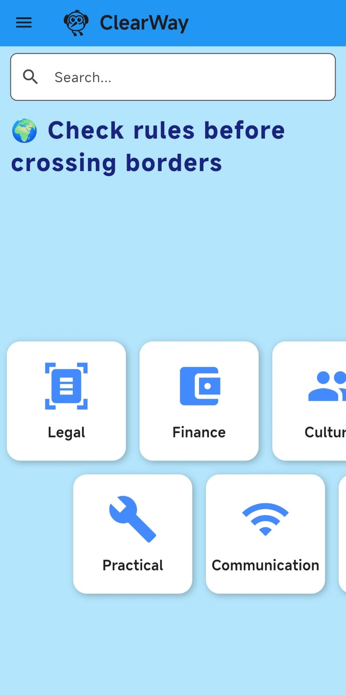
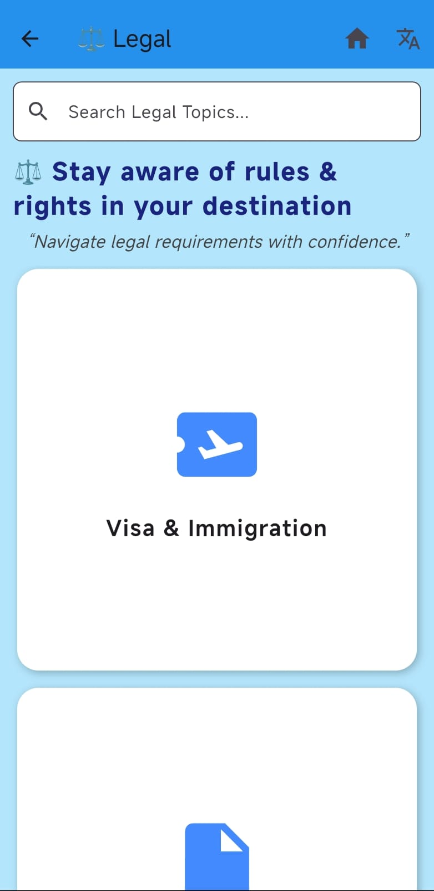
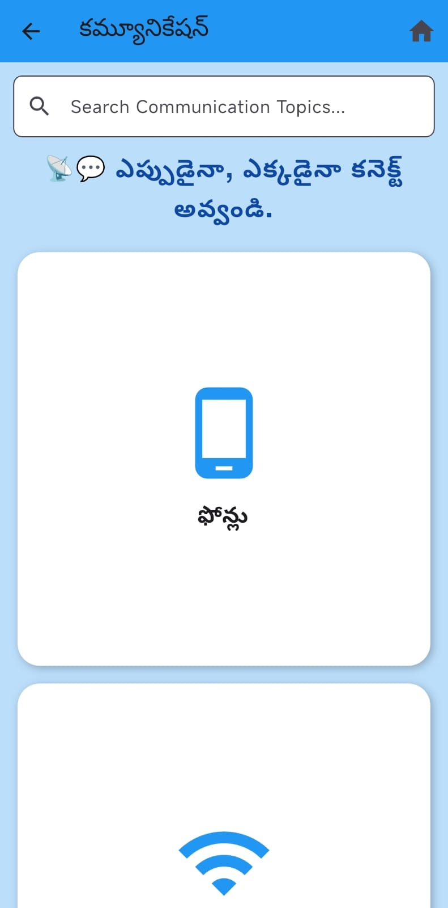
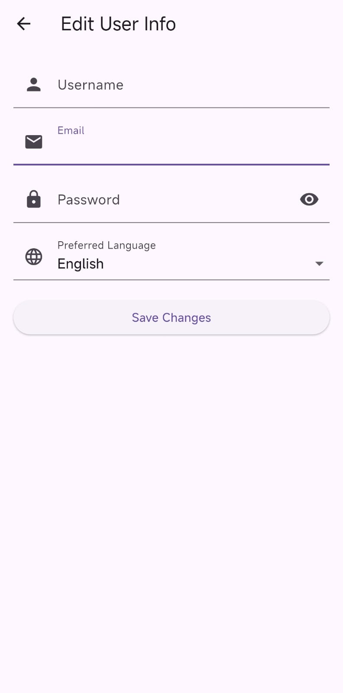

# clearway
ClearWay provides domain-specific guidance (legal, finance, driving, cultural, and practical) for individuals traveling or moving to new locations. With multilingual support and a simple interface, the app makes it easy for users to understand and follow local rules and policies.

## Team members
  Saraf Vaishnavi Sree  -  cs24b051
  Maddi Sri Varshini    -  cs24b021
  Burrem Nandini Goud   -  cs24b008
  Thaduri Vaishnavi     -  cs24b047
  Meda Tharsha Sri      -  cs24b024

  ## Features
### ->  📱 Onboarding : Simple sign-up/login process with preferred language selection. 
### -> 🔒 Authentication : Secure account creation and login.  
### -> 📝 Profile Management : Edit username, email, password, and preferred language.  
### -> 🌐 Categories : Guidance split into sections:  
  - Legal (Visa, Immigration, Documents, Banking, Taxes)  
  - Finance (Bank accounts, financial planning, Closing/settling accounts)  
  - Cultural (Communication Styles, Work Culture, Family Dynamics and Society, Everyday Norms) 
  - Emotional (Adaptability, Support systems)
  - Communication (Phones, Digital Preparedness)
  - Practical (Driving, accomodation, Packing & Shipping, Healthcare Preparations)
  - Settling (Identification, Insurance, Local Transportation)
### -> 🗂 Subcategories : Each category contains specific guidance (e.g., Legal → Visa & Immigration, Taxes, etc.).  
### -> 🌍 State-specific rules : Shows rule differences based on the user’s selected states during sign-up.  

## 🛠 App Flow
1. Splash Screen → Displays the ClearWay logo.  
2. Get Started → For first-time users.  
3. *Sign Up* → Collects details like username, email, password, origin, destination, and preferred language and our application facilitates the acquisition of information through voice input .  
4. *Login* → For existing users (only email/username + password needed).  
5. *Home Screen* → Shows categories (Legal, Finance, Cultural, Communication, Practical, Emotional, Settling).  
6. *Navigation Drawer (☰)*:  
   - User info (name, email)  
   - Change Password  
   - Preferred Language  
   - Close / Logout  
   - Edit Profile ✏  
7. *Category Pages* → Each category → subcategories (e.g., Legal → Visa, Documents, Banking, Taxes).  
8. *State-Specific Guidance* → Subcategory displays differences in rules between origin and destination states.

## Images

### App Logo:

### Get Started:

### SignUp page:

### Login page:

### Home page:

### Sub pages:

### Sub page(including translations):

### Rules card:

### Edit user page:

  
