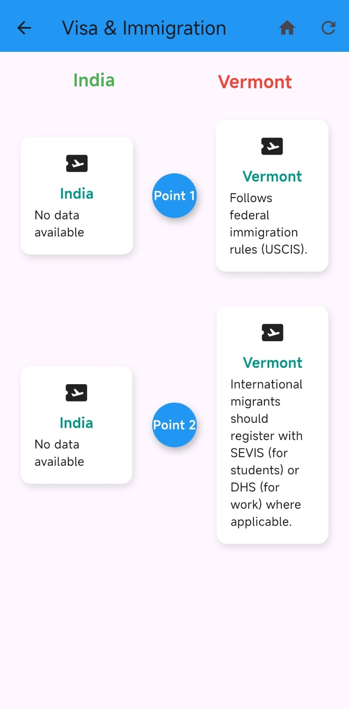

# clearway
ClearWay provides domain-specific guidance (legal, finance, driving, cultural, and practical) for individuals traveling or moving to new locations. With multilingual support and a simple interface, the app makes it easy for users to understand and follow local rules and policies.

## Team members
  Saraf Vaishnavi Sree  -  cs24b051
  Maddi Sri Varshini    -  cs24b021
  Burrem Nandini Goud   -  cs24b008
  Thaduri Vaishnavi     -  cs24b047
  Meda Tharsha Sri      -  cs24b024

  ## Features
### ->  📱 Onboarding : Simple sign-up/login process with preferred language selection. 
### -> 🔒 Authentication : Secure account creation and login.  
### -> 📝 Profile Management : Edit username, email, password, and preferred language.  
### -> 🌐 Categories : Guidance split into sections:  
  - Legal (Visa, Immigration, Documents, Banking, Taxes)  
  - Finance (Bank accounts, financial planning, Closing/settling accounts)  
  - Cultural (Communication Styles, Work Culture, Family Dynamics and Society, Everyday Norms) 
  - Emotional (Adaptability, Support systems)
  - Communication (Phones, Digital Preparedness)
  - Practical (Driving, accomodation, Packing & Shipping, Healthcare Preparations)
  - Settling (Identification, Insurance, Local Transportation)
### -> 🗂 Subcategories : Each category contains specific guidance (e.g., Legal → Visa & Immigration, Taxes, etc.).  
### -> 🌍 State-specific rules : Shows rule differences based on the user’s selected states during sign-up.  

## 🛠 App Flow
1. Splash Screen → Displays the ClearWay logo.  
2. Get Started → For first-time users.  
3. *Sign Up* → Collects details like username, email, password, origin, destination, and preferred language and our application facilitates the acquisition of information through voice input .  
4. *Login* → For existing users (only email/username + password needed).  
5. *Home Screen* → Shows categories (Legal, Finance, Cultural, Communication, Practical, Emotional, Settling).  
6. *Navigation Drawer (☰)*:  
   - User info (name, email)  
   - Change Password  
   - Preferred Language  
   - Close / Logout  
   - Edit Profile ✏ 
7. *Category Pages* → Each category → subcategories (e.g., Legal → Visa, Documents, Banking, Taxes).  
8. *State-Specific Guidance* → Subcategory displays differences in rules between origin and destination states.

## Images

### App Logo:

### Get Started:

### SignUp page:

### Login page:

### Home page:

### Sub pages:

### Sub page(including translations):

### Rules card:

### Edit user page:

## Tech flow
### 💻 Tech Stack
- *Frontend*: Flutter,Dart
- *Backend*: Firebase(with tools) 
- *Database*: Firbase(database),JSON format
- *Authentication*: Firebase  
- *Other Tools*: NodeJS, GitHub for version control

### Contributions:
Tharsha (front-end):
- *Splash / Logo Page* – Designed an attractive splash screen with branding .
- *Signup Page*– Built a user-friendly account creation interface with clear input fields and validations.
- *Login Page* – Developed a clean login screen with intuitive navigation and secure input handling.
- *Main Dashboard* – Created a centralized dashboard for easy access to key features and user data.
- *Subpages / Modules* – Designed consistent layouts for feature pages, maintaining cohesive UI/UX.
- *Voice Search* – (signup page)Implemented front-end support for voice commands with responsive UI elements.

Vaishnavi T (Backend )
- *User Authentication* – Backend logic for Signup/Login, validation, secure passwords.
- *Main Page & Subpages* – Backend connections for loading content and navigation.
- *Translation Service* – Worked on Google Translator API integration.
- *Firebase Authentication* – Signup/Login/Password management.
- *Firestore Database* – Store user profiles, app data, and content.
- *Realtime Sync* – Live updates between frontend and backend.
- *Firebase Connections* – Integrating the app with Firebase services.

S. Vaishnavi Sree (Backend)
- *US Data Management* – Backend logic to fetch and manage US-specific data for states.
- *JSON File Creation* – Collected and structured US data into JSON format.
- *Subpages Functionality* – Backend support for dynamically loading content and applying the UI format to all subpages.f
- *GitHub Repository* - source code management, collaboration, and version tracking.
- *Testing* – Backend testing to ensure proper functionality, data handling, and reliability of all modules.
- *Firebase Connections* – Integrating the app with Firebase services.

B. Nandini (Backend)
- *India Data Management* – Backend logic to fetch and manage India-specific data for states.
- *JSON File Creation* – Collected and structured India data into JSON format.
- *Translation Service* – Integration with Google Translator API to provide real-time translation across app content.
- *Subpages Functionality* – Backend for dynamically loading content and handling user interactions on all subpages.
- *Firebase Connections* - Integrating the app with firebase services.
- *README File* – Detailed project description, features, structure, and individual contributions.

Varshini (Front-end)
- *Get Started Page* – Introductory page guiding users when they first open the app.
- *UI Cards for Subpages* – Designed and implemented UI cards for displaying rules of each domain in the application.
- *Signup* -Developed signup functionality with username,password,email input fields with proper regexs including validation.
- *Login Page* - Designed and implemented a secure and user-friendly login screen with validations.
- *Testing* – Front-end testing to ensure proper layout, responsiveness, and user interactions.
-	*GitHub Repository* – Source code management, collaboration, and version tracking.
-	*README File* – Detailed project description, features, screenshots, and individual contributions.
  
## Overview
Our application is designed to assist individuals migrating to new locations by providing clear and comprehensive information about the rules and regulations of their destination. The app collects details regarding both the origin and destination locations, enabling users to compare relevant laws, policies, and regulations side by side. A comparative table is displayed, highlighting the differences between the two regions to help users adapt seamlessly to their new environment.

  
